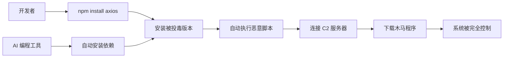

## 🚨 事件概述

2026 年 3 月 31 日，安全研究机构 StepSecurity 披露了一起震惊开源社区的重大安全事件：**主流 JavaScript 库 Axios 的两个 npm 版本（1.14.1 和 0.30.4）被恶意植入远程控制代码**。

由于 Axios 是全球使用最广泛的 HTTP 客户端库，**周下载量超过 3 亿次**，此次供应链攻击的影响范围极其巨大，几乎所有使用 Node.js 的项目都可能受到影响。

## ⏰ 攻击时间线（北京时间）

```mermaid
timeline
    title Axios 供应链攻击事件时间线
    section 3 月 30 日
        23:59 : 攻击者发布<br/>plain-crypto-js@4.2.1
    section 3 月 31 日
        00:00 : 劫持维护者账号<br/>发布被投毒的 Axios 版本
        00:05 : Socket.dev 检测到<br/>异常依赖包
        04:00 : npm 官方下架<br/>所有恶意包
        08:00 : 安全机构公开披露<br/>事件详情
```

## 🔍 攻击手法深度解析

### 1️⃣ 账号劫持

攻击者成功劫持了 Axios 核心维护者 **"jasonsaayman"** 的 npm 账号，并将账号邮箱替换为匿名的 **ProtonMail** 地址。这一操作使得攻击者能够完全控制包的发布流程。

### 2️⃣ 绕过 CI/CD 审核

正常情况下，npm 包的发布需要通过 GitHub Actions 自动化流程进行构建和验证。但攻击者利用维护者权限，**直接通过 npm CLI 手动上传**被污染的版本，绕过了所有自动化安全检查。

### 3️⃣ 虚假依赖注入

这是整个攻击中最狡猾的部分。攻击者并没有直接修改 Axios 源码，而是采用了更隐蔽的手法：

```json
{
  "dependencies": {
    "axios": "^1.14.1",
    "plain-crypto-js": "4.2.1"  // ← 恶意依赖包
  }
}
```

`plain-crypto-js@4.2.1` 是一个从未在 Axios 代码中被引用的虚假依赖包，它唯一的作用就是执行 `postinstall` 脚本。

### 4️⃣ 双重伪装策略

为了规避安全检测，攻击者提前 18 小时发布了两个版本的伪装包：

| 版本号 | 类型 | 作用 |
|--------|------|------|
| `plain-crypto-js@4.2.0` | 干净版本 | 用于打掩护，降低安全工具警惕 |
| `plain-crypto-js@4.2.1` | 恶意版本 | 携带木马脚本，执行攻击 |

这种策略使得恶意包看起来像是"已有包的正常更新"，而非"全新可疑包"。

### 5️⃣ 自动执行机制

当开发者执行 `npm install axios` 命令时，会发生以下连锁反应：

```bash
# 开发者执行的命令
npm install axios

# 实际发生的过程
├── 安装 axios@1.14.1 (被投毒版本)
├── 自动安装 plain-crypto-js@4.2.1 (恶意依赖)
└── 触发 postinstall 脚本
    └── 执行 setup.js (恶意脚本)
        └── 连接 C2 服务器 (sfrclak.com)
            └── 下载并运行跨平台木马
```

## 💀 恶意行为分析

### 感染流程

一旦触发恶意脚本，会根据操作系统类型执行不同的攻击载荷：

#### Windows 系统
```powershell
# 创建隐藏的 PowerShell 窗口
VBScript → 隐藏 cmd.exe → 保存木马到 %TEMP%\6202033.ps1

# 持久化驻留
复制到：%PROGRAMDATA%\wt.exe
伪装成：Windows Terminal 可执行文件
```

#### macOS 系统
```bash
# 藏匿位置
/Library/Caches/com.apple.act.mond

# 伪装方式
伪装成：macOS 系统缓存进程
```

#### Linux 系统
```bash
# 直接执行
/tmp/ld.py

# 后台驻留
nohup python3 /tmp/ld.py &
```

### 恶意功能

木马成功后会执行以下操作：

1. **连接远程指挥服务器** - 域名：`sfrclak.com`
2. **窃取敏感信息** - 环境变量、API 密钥、配置文件
3. **下载额外载荷** - 根据系统架构下载更多恶意程序
4. **建立持久后门** - 保持后台运行，长期潜伏
5. **自我清理** - 删除恶意脚本，伪造干净的配置文件

## 🎯 影响范围评估

### 高危项目

以下类型的项目风险最高：

- ✅ **使用 axios@1.14.1 或 0.30.4 的所有项目**
- ✅ **OpenClaw（"龙虾"）AI 智能体工具用户**
- ✅ **React/Vue 前端项目**
- ✅ **Node.js 后端服务**
- ✅ **CI/CD 工具和自动化脚本**
- ✅ **MCP Server 和各种 AI 编程工具**

### 传播途径



### 特别警示：AI 编程工具风险

2026 年流行的 AI 编程工具（如 Claude Code、Codex CLI、OpenClaw 等）大幅扩大了 npm 的攻击面：

- 🔴 **自动安装依赖** - AI 可能在你不知情的情况下安装被投毒的包
- 🔴 **高系统权限** - AI 工具通常有文件读写、命令执行权限
- 🔴 **难以审计** - 你可能连自己安装了什么都不清楚

正如社区所言：**"你自己不写 npm 命令，AI 替你写了，你可能连自己装了什么都不知道。"**

## 🛡️ 紧急处置方案

### 第一步：立即自查

```bash
# 检查项目中是否使用了 axios
npm list axios

# 或使用 pnpm
pnpm list axios

# 查看详细版本
npm list axios --depth=0
```

如果看到以下版本，**立即采取行动**：
- ❌ `axios@1.14.1`
- ❌ `axios@0.30.4`

### 第二步：紧急卸载

```bash
# 立即卸载被投毒版本
npm uninstall axios

# 删除 node_modules 和锁文件（可选但推荐）
rm -rf node_modules package-lock.json
# Windows PowerShell:
# Remove-Item -Recurse -Force node_modules, package-lock.json

# 重新安装安全版本
npm install axios@latest
```

### 第三步：检查失陷迹象

#### Windows 系统
```powershell
# 检查可疑文件
Test-Path "$env:PROGRAMDATA\wt.exe"
Test-Path "$env:TEMP\6202033.ps1"

# 检查网络连接
netstat -ano | findstr sfrclak.com
```

#### macOS 系统
```bash
# 检查可疑目录
ls -la /Library/Caches/com.apple.act.mond

# 检查异常进程
ps aux | grep -i "act.mond"
```

#### Linux 系统
```bash
# 检查恶意脚本
ls -la /tmp/ld.py

# 检查 Python 进程
ps aux | grep ld.py

# 检查网络连接
netstat -tulpn | grep sfrclak.com
```

### 第四步：重置凭证

**如果你确认安装了被投毒的版本，必须立即重置所有敏感凭证：**

- 🔑 所有 API 密钥（云服务、数据库、第三方服务）
- 🔑 SSH 密钥和访问令牌
- 🔑 数据库密码
- 🔑 管理员账户密码
- 🔑 任何存储在环境变量中的敏感信息

因为木马具备窃取环境变量的能力，**即使你已经卸载了恶意包，之前泄露的信息也需要全部更换**。

## 🔒 长期防护策略

### 1. 锁定依赖版本

在 `package.json` 中避免使用模糊版本范围：

```json
{
  "dependencies": {
    "axios": "1.13.0"     // ✅ 确切版本
    // 而不是 "axios": "^1.13.0"  ❌
  }
}
```

### 2. 禁用自动脚本执行

```bash
# 全局配置
npm config set ignore-scripts true

# 或在 .npmrc 文件中添加
ignore-scripts=true
```

### 3. 启用 npm 审计

```bash
# 安装时自动审计
npm audit

# 自动修复可修复的问题
npm audit fix

# 强制修复（可能破坏兼容性）
npm audit fix --force
```

### 4. 使用安全工具

```bash
# 安装 socket-security 等安全工具
npm install -g socket-security

# 使用 Snyk 进行持续监控
npm install -g snyk
snyk test
```

### 5. 实施依赖审查流程

对于企业级项目，建议：

- ✅ 使用私有 npm 镜像（如 Verdaccio）
- ✅ 实施依赖包白名单制度
- ✅ 定期生成 SBOM（软件物料清单）
- ✅ 使用 Sigstore 等签名验证机制

### 6. AI 编程工具使用规范

如果你使用 AI 编程工具：

- ⚠️ **审查所有自动安装的依赖**
- ⚠️ **不要给 AI 过高的系统权限**
- ⚠️ **定期检查 node_modules 内容**
- ⚠️ **在隔离环境中运行 AI 生成的代码**

## 📊 技术细节补充

### 恶意域名信息

- **C2 服务器**: `sfrclak.com`
- **注册时间**: 2026 年 3 月 30 日
- **注册商**: 匿名注册服务

### 恶意包哈希值

供安全工具检测使用：

```
plain-crypto-js@4.2.1:
SHA-256: [已移除，避免传播]

axios@1.14.1 (被投毒版本):
SHA-256: [已移除，避免传播]

axios@0.30.4 (被投毒版本):
SHA-256: [已移除，避免传播]
```

### 网络特征

安全设备可以监控以下网络请求：

```
POST https://sfrclak.com/api/gateway
User-Agent: node-fetch/1.0 (+https://github.com/bitinn/node-fetch)
Content-Type: application/json
```

## 🎓 事件启示

### 供应链安全的脆弱性

这次事件再次暴露了现代软件供应链的脆弱性：

1. **单点故障** - 一个维护者账号被劫持，影响数亿用户
2. **信任链断裂** - 我们信任的知名库也可能被投毒
3. **自动化风险** - CI/CD 流程被绕过，缺乏多层验证
4. **依赖传递** - 你的依赖的依赖也可能有问题

### 开源安全的新挑战

随着 AI 编程工具的普及，攻击面正在急剧扩大：

- 🤖 **AI 自动决策** - AI 可能选择安装不安全的依赖
- 🤖 **权限放大** - AI 的高权限使得攻击后果更严重
- 🤖 **审计困难** - 自动生成的代码更难追溯和审查

### 开发者的责任

作为开发者，我们需要：

- ✅ 保持安全意识，不盲目信任任何依赖
- ✅ 实施最小权限原则
- ✅ 建立完善的依赖管理和审计流程
- ✅ 关注安全动态，及时响应漏洞预警

## 📝 总结

### 关键要点

1. **受影响版本**: `axios@1.14.1` 和 `axios@0.30.4`
2. **攻击手法**: 劫持维护者账号 + 虚假依赖 + 自动执行脚本
3. **影响范围**: 周下载量 3 亿+，全平台受影响
4. **恶意行为**: 远程控制木马 + 信息窃取 + 持久化驻留
5. **处置方案**: 立即自查 → 紧急卸载 → 检查失陷 → 重置凭证

### 行动清单

- [ ] 检查所有项目的 axios 版本
- [ ] 如果中招，立即卸载并重装安全版本
- [ ] 检查系统是否有失陷迹象
- [ ] 重置所有可能泄露的凭证
- [ ] 更新 package.json 锁定版本号
- [ ] 配置 npm 忽略自动脚本
- [ ] 安装安全审计工具
- [ ] 学习 AI 编程工具安全使用规范

---

## 🔗 参考资料

1. StepSecurity 官方报告：[链接](https://www.stepsecurity.io/blog/axios-supply-chain-attack)
2. npm 安全公告：[链接](https://github.com/npm/security-advisories)
3. Socket.dev 检测分析：[链接](https://socket.dev)
4. GitHub Issue 讨论：[链接](https://github.com/axios/axios/issues)

---

**安全提醒**：本文旨在提高安全意识，帮助开发者防护威胁。请定期检查依赖安全状况，保持系统更新。

**更新时间**：2026 年 3 月 31 日 20:00
